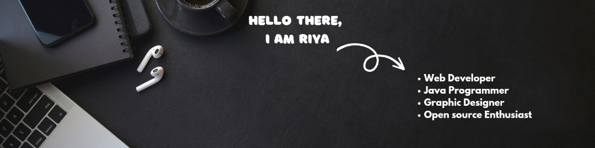

### Hi Amigos👋, I'm Riya Dangra 

  

<h3 align="center">A Girl Exploring the Stuffs!!!</h3>

  

- 🏫 I'm 3rd year student pursuing Bachelors in Computer Science & Engineering. 
- 🌱 I'm currently learning **React JS**
- 💻 I'm also  **Social Media Head** at E-cell SSGMCE .

- 💬 Ask me about **Roadmap for learning Web Development,Open Source Contribution,Graphic Designing**

- 📫 How to reach me **riyadangra1418@gmail.com**

- ⚡ Fun fact **I think I am Funn XD**

<h3 align="left">Connect with me:</h3>

<h3 align="left">Languages and Tools:</h3>

       

  
  

<h3 align="center">Show some &nbsp;❤️&nbsp; by starring some of the repositories!</h3>

